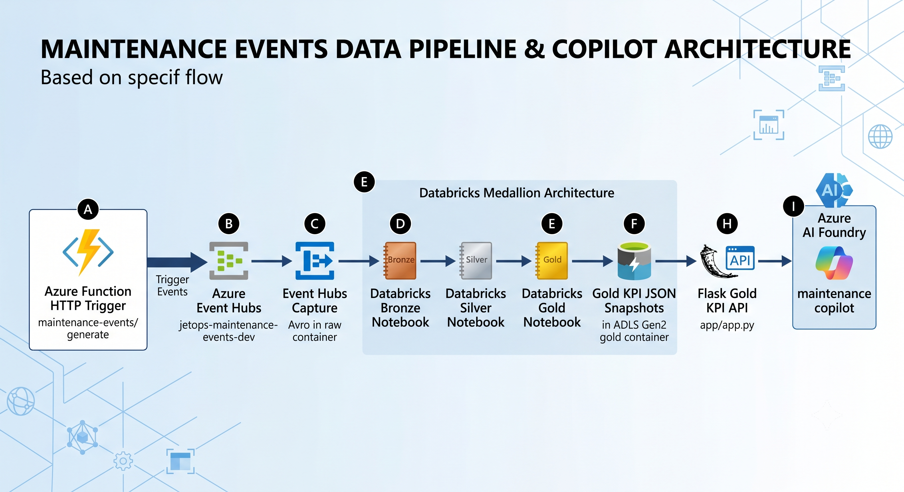
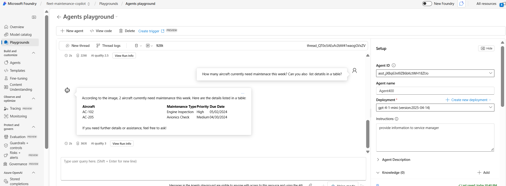

# JetOps Lakehouse

JetOps Lakehouse is an Azure-first maintenance operations reference project. It combines Terraform-managed infrastructure, a Databricks medallion pipeline, a synthetic Event Hubs producer, a Gold KPI API, and an Azure AI Foundry fleet-maintenance copilot grounded by both a structured KPI API tool and an Azure AI Search RAG tool over maintenance history.

This repo is centered on JetOps maintenance events and the path from event generation to Gold KPI serving.

## What Is In This Repo

- Terraform for Azure storage, networking, Databricks, Event Hubs, and related lakehouse components.
- An Azure Functions app that generates synthetic maintenance events into Event Hubs.
- Databricks notebooks for Bronze, Silver, and Gold maintenance processing.
- A Flask API that serves Gold KPI snapshots from ADLS Gen2.
- Azure AI Foundry setup notes and version-management scripts for a maintenance copilot.
- An Azure AI Search RAG index over maintenance history, wired into the Foundry agent alongside the Gold KPI API tool.

## Architecture



## Main Components

### Infrastructure

- Root Terraform files provision the baseline Azure environment.
- The [lakehouse/herbalife_eventhub.tf](lakehouse/herbalife_eventhub.tf) module adds the Event Hub namespace and hub wiring used by the JetOps event flow.
- Environment-specific names are carried through the tracked Terraform variables and `tfvars` values.

### Event Generator

The Azure Functions app in [azure_function_eventhub/function_app.py](azure_function_eventhub/function_app.py) exposes an HTTP-triggered endpoint that sends synthetic maintenance events to Event Hubs.

Key behavior:

- Route: `GET` or `POST` `/api/maintenance-events/generate`
- Default volume: `25` events
- Optional repeatability: `seed`
- Max volume: `500` events per request

The event payload generator lives in [azure_function_eventhub/maintenance_events.py](azure_function_eventhub/maintenance_events.py).

### Databricks Medallion Notebooks

The notebooks under [app/bronze_maintenance_events.ipynb](app/bronze_maintenance_events.ipynb), [app/silver_maintenance_events.ipynb](app/silver_maintenance_events.ipynb), [app/gold_maintenance_kpis.ipynb](app/gold_maintenance_kpis.ipynb), and [app/gold_kpi_inspection.ipynb](app/gold_kpi_inspection.ipynb) implement the maintenance-event pipeline.

Current flow:

1. Bronze reads raw Event Hubs capture and normalizes maintenance events.
2. Silver cleans and deduplicates events.
3. Gold builds KPI marts for daily operations, component reliability, and fleet status.
4. Gold also writes JSON snapshot outputs for the serving API.

The Databricks job chain definition is in [databricks_cluster/maintenance_notebook_job_chain.json](databricks_cluster/maintenance_notebook_job_chain.json).
With that schedule enabled, new generated events automatically move from Event Hubs capture to Bronze, Silver, Gold, and finally into the Gold API snapshot folders that [app/gold_kpi_service.py](app/gold_kpi_service.py) serves.

### Gold KPI API

The API in [app/app.py](app/app.py) serves curated KPI data backed by [app/gold_kpi_service.py](app/gold_kpi_service.py).

Primary endpoints:

- `GET /api/gold/health`
- `GET /api/gold/metadata`
- `GET /api/gold/openapi.json`
- `GET /api/gold/kpis/executive`
- `GET /api/gold/kpis/daily-operations?days=14`
- `GET /api/gold/kpis/component-reliability?days=7&limit=20`
- `GET /api/gold/kpis/fleet-watchlist?limit=50`

Important behavior:

- All `/api/gold/*` routes require the `x-api-key` header.
- The API reads JSON snapshots from the Gold container in ADLS Gen2.
- The root `/` route still supports a legacy SQL-backed dashboard when `JETOPS_SQL_CONNECTION_STRING` is configured.

The OpenAPI contract checked into the repo is [app/gold_kpi_api_openapi.json](app/gold_kpi_api_openapi.json).

### Azure AI Foundry

The Foundry integration notes are in [azure_foundry_incorporation.md](azure_foundry_incorporation.md) and [foundry/fleet_maintenance_copilot_setup.md](foundry/fleet_maintenance_copilot_setup.md).

The version-management script is [scripts/manage_foundry_agent_versions.py](scripts/manage_foundry_agent_versions.py). It is intended to:

- fetch the protected OpenAPI document
- attach it to the Foundry agent through the `jetops-gold-api-key` project connection
- create a new agent version
- compare the latest versions on a fixed question set

The script expects additional Python packages beyond the Flask API requirements, including `azure-ai-projects`, `azure-identity`, `jsonref`, and `requests`.

The stored comparison artifact is [foundry/agent_version_comparison.json](foundry/agent_version_comparison.json).

For ad hoc or scripted Q&A against the deployed agent, use [scripts/ask_copilot.py](scripts/ask_copilot.py) (interactive console) or [scripts/demo_questions.py](scripts/demo_questions.py) (runs a fixed set of demo questions). Both require `az login` against the target tenant/subscription and the `azure-ai-projects` / `azure-ai-agents` / `azure-identity` packages.

#### Maintenance History RAG (Azure AI Search)

`fleet-maintenance-copilot-agent` has a second tool alongside the Gold KPI API: an **Azure AI Search** tool grounded against the `jetops-maintenance-history` index. This lets the agent answer narrative questions (e.g. "what past hydraulic leak incidents have there been?") that the KPI API cannot, since the KPI API only returns aggregated numbers, not repair narratives.

Pieces involved:

- [lakehouse/herbalife_search.tf](lakehouse/herbalife_search.tf) provisions the `srch-herbalife-dev` Azure AI Search service (Basic tier).
- [scripts/build_maintenance_search_index.py](scripts/build_maintenance_search_index.py) reads [app/maintenance_logs_sample_data.sql](app/maintenance_logs_sample_data.sql), embeds each record with `text-embedding-3-small` via the Foundry project's Azure OpenAI connection, and upserts both keyword and vector fields into the `jetops-maintenance-history` index.
- The Foundry project connection `jetops-maintenance-search` (category `CognitiveSearch`) points the agent at that Search service.
- `scripts/manage_foundry_agent_versions.py` attaches the `AzureAISearchTool` to new agent versions using that connection, with `query_type='simple'`.

Note: the tool currently runs keyword (`simple`) search, not vector search. Embeddings are stored in the index, but Foundry's `AzureAISearchTool` needs an **integrated vectorizer** on the index's vector field to do vector search itself (it sends raw query text, not pre-computed vectors). Adding that vectorizer is the natural next step for true semantic retrieval.

To rebuild the index after data changes:

```powershell
az login
$env:AZURE_SEARCH_ENDPOINT = "https://srch-herbalife-dev.search.windows.net"
$env:AZURE_SEARCH_KEY = (az search admin-key show --service-name srch-herbalife-dev --resource-group rg-herbalife-dev-core --query primaryKey -o tsv)
py scripts/build_maintenance_search_index.py
```

#### Agent Tools: OpenAPI Tool vs. AzureAISearchTool

`fleet-maintenance-copilot-agent` can call two structurally different tools, plus a no-tool fallback:

| | OpenAPI tool (`jetops_gold_kpi_api`) | `AzureAISearchTool` (`jetops-maintenance-history`) |
|---|---|---|
| Backed by | Your own Flask API (`app/app.py`) | A managed Azure AI Search index |
| Execution | Real HTTP request to the Container App, authenticated via the `jetops-gold-api-key` connection | Direct query to the Search service via the `jetops-maintenance-search` connection |
| Returns | Structured JSON — pre-aggregated KPI numbers | Unstructured narrative text — matching log records |
| Best for | "How many," "which is worst," current-state/aggregate questions | "What happened," "has this aircraft had this issue before" |

If neither applies, the model answers directly from its own knowledge with no external call.


**Why the Gold KPI API needs a Container App at all:** Azure AI Search and Azure OpenAI are first-party managed services — Microsoft already runs them, so Foundry just calls them over the network. The Gold KPI API is different: it's custom code ([app/app.py](app/app.py) + [app/gold_kpi_service.py](app/gold_kpi_service.py)) that reads ADLS Gen2 snapshots, applies query params, and validates `x-api-key`. Nothing in Azure runs that code for you — it has to be hosted somewhere with a real HTTPS endpoint, which is what the `jetops-gold-api` Container App provides. Container Apps was chosen over AKS (too much operational overhead for one small API) and over Azure Functions (wrong execution model for a persistent REST contract; Functions is used instead for the event generator, which fits its trigger-driven model).

### MCP SQL Explorer

[mcp_sql_server/server.py](mcp_sql_server/server.py) is an MCP server for ad hoc, read-only SQL exploration against the same Aviator Core maintenance database the legacy dashboard route in [app/app.py](app/app.py) uses. It exposes three tools over the streamable-http MCP transport:

- `list_tables()` — enumerate tables in the database
- `describe_table(table_name, schema)` — list a table's columns, types, and nullability
- `run_query(sql, max_rows)` — run a single `SELECT` (optionally `WITH ... SELECT`) statement and return up to 200 rows; `INSERT`/`UPDATE`/`DELETE`/`DROP`/`ALTER`/etc. and multi-statement batches are rejected

It connects via `JETOPS_SQL_CONNECTION_STRING`, the same env var used by the Gold API's legacy dashboard route.

**Networking:** the server runs as `jetops-sql-explorer` in AKS, in the `aviator-core` namespace. AKS nodes now join the dedicated `snet-aks-aviator` subnet (`azurerm_subnet.aks_subnet` in [networking.tf](networking.tf)) so they land inside the `vnet-spoke-aviator` VNet and can reach the SQL private endpoint — previously AKS had no `vnet_subnet_id` set, so it silently created its own unpeered VNet and nothing running in it could ever reach SQL. Reaching AKS's own subnet requires the cluster identity to hold Network Contributor on it, added as `azurerm_role_assignment.aks_network_contributor` in [aviator_app_identity.tf](aviator_app_identity.tf).

**Deploying:**

```powershell
az acr build --resource-group rg-aviator-core-prod --registry aviatoracrjetops01 --image mcp-sql-server:latest --file mcp_sql_server/Dockerfile mcp_sql_server
```

The `aviator-sql-connection` Kubernetes secret is deliberately **not** defined in [mcp_sql_server/deployment.yaml](mcp_sql_server/deployment.yaml), so the connection string never lands in git. Create it out of band before applying the deployment:

```powershell
kubectl create namespace aviator-core --dry-run=client -o yaml | kubectl apply -f -
kubectl create secret generic aviator-sql-connection `
  --namespace aviator-core `
  --from-literal=JETOPS_SQL_CONNECTION_STRING="<same value as JETOPS_SQL_CONNECTION_STRING>"
kubectl apply -f mcp_sql_server/deployment.yaml
```

#### Foundry Playground Example

The screenshot below is an example Azure AI Foundry playground view inside the `fleet-maintenance-copilot` project.

For live KPI validation, use the repo-managed agent `fleet-maintenance-copilot-agent`. Older ad hoc playground agents such as `Agent400` are not authoritative and can be missing the protected Gold API tool wiring.



## Repo Layout

```text
.
|-- app/
|   |-- app.py
|   |-- gold_kpi_service.py
|   |-- gold_kpi_api_openapi.json
|   |-- bronze_maintenance_events.ipynb
|   |-- silver_maintenance_events.ipynb
|   |-- gold_maintenance_kpis.ipynb
|   |-- gold_kpi_inspection.ipynb
|   |-- configure_sas_access.ipynb
|   |-- Dockerfile
|   `-- requirements.txt
|-- azure_function_eventhub/
|   |-- __init__.py
|   |-- function_app.py
|   |-- maintenance_events.py
|   |-- local.settings.sample.json
|   |-- requirements.txt
|   `-- smoke_test.py
|-- databricks_cluster/
|   |-- main.tf
|   |-- variables.tf
|   `-- maintenance_notebook_job_chain.json
|-- foundry/
|   |-- fleet_maintenance_copilot_setup.md
|   `-- agent_version_comparison.json
|-- scripts/
|   |-- ask_copilot.py
|   |-- demo_questions.py
|   |-- demo_start.ps1
|   |-- demo_down.ps1
|   |-- demo_up.ps1
|   |-- bulk_trigger_load.py
|   |-- build_maintenance_search_index.py
|   |-- manage_foundry_agent_versions.py
|   |-- smoke_test_adls_foundry.py
|   `-- stop_bulk_trigger_load.py
|-- mcp_sql_server/
|   |-- server.py
|   |-- Dockerfile
|   |-- deployment.yaml
|   `-- requirements.txt
|-- lakehouse/
|   |-- herbalife_databricks_workspace.tf
|   |-- herbalife_eventhub.tf
|   |-- herbalife_monitor.tf
|   |-- herbalife_network.tf
|   |-- herbalife_search.tf
|   |-- herbalife_storage.tf
|   |-- herbalife_stream_analytics.tf
|   |-- providers.tf
|   |-- outputs.tf
|   `-- variables.tf
|-- docs/
|   `-- architecture.png
`-- picture/
    `-- Agent.png
```

Root-level Terraform files (`aks.tf`, `networking.tf`, `database_SQL.tf`, `registry-ACR.tf`, `variable.tf`, etc.) provision the broader Aviator Core platform that the JetOps lakehouse runs on; they are out of scope for this README's pipeline walkthrough.

## Prerequisites

- Python `3.11+` for the Flask API and Azure Function local runs.
- Azure Functions Core Tools for local Function testing.
- Azure CLI for storage-key lookup and other Azure operations.
- Access to the target Azure subscription, Databricks workspace, storage account, and Event Hub.
- Databricks workspace access if you want to run the notebooks in-cluster.

## Local Workflows

### 1. Run The Azure Function Locally

```powershell
cd azure_function_eventhub
Copy-Item local.settings.sample.json local.settings.json
py -m pip install -r requirements.txt
func start
```

Then send synthetic events:

```powershell
Invoke-RestMethod "http://localhost:7071/api/maintenance-events/generate"
Invoke-RestMethod "http://localhost:7071/api/maintenance-events/generate?count=100"
Invoke-RestMethod "http://localhost:7071/api/maintenance-events/generate?count=100&seed=42"
```

For larger backfills or repeatable load generation, use the bulk trigger script from the repo root:

```powershell
py scripts/bulk_trigger_load.py --iterations 10 --count-per-request 500 --delay-seconds 2
```

To keep sending data until you explicitly stop it:

```powershell
py scripts/bulk_trigger_load.py --continuous --count-per-request 500 --delay-seconds 5
```

To stop a running load loop from another terminal:

```powershell
py scripts/stop_bulk_trigger_load.py
```

Add `--force` to the stop command if you need the tracked loader process terminated immediately.

For a quick local smoke test without Event Hubs, use [azure_function_eventhub/smoke_test.py](azure_function_eventhub/smoke_test.py).

### 2. Run The Gold KPI API Locally

```powershell
cd app
py -m pip install -r requirements.txt
$env:JETOPS_API_KEY = "replace-me"
$env:JETOPS_STORAGE_ACCOUNT_KEY = "replace-me"
py app.py
```

Example requests:

```powershell
Invoke-RestMethod -Headers @{ "x-api-key" = $env:JETOPS_API_KEY } "http://localhost:8000/api/gold/health"
Invoke-RestMethod -Headers @{ "x-api-key" = $env:JETOPS_API_KEY } "http://localhost:8000/api/gold/kpis/executive"
```

### 3. Validate In Databricks

Use the notebooks in [app](app) for the medallion flow.

Important auth detail:

- The notebooks still support SAS-token secrets.
- The current default is `JETOPS_STORAGE_AUTH_MODE=account_key`.
- That path expects the Databricks secret `storage-account-key` unless you override the secret names.

If you use [app/configure_sas_access.ipynb](app/configure_sas_access.ipynb), that notebook is specifically for SAS-token setup. The Bronze, Silver, and Gold notebooks default to account-key mode.

### 4. Build The Gold API Container

The API container build path in this repo is:

```powershell
az acr build --resource-group rg-aviator-core-prod --registry aviatoracrjetops01 --image jetops-gold-api:latest --file app/Dockerfile app
```

The container definition is in [app/Dockerfile](app/Dockerfile).

## Cost Management: Pausing Infra Between Demos

This is a demo project, not a 24/7 service, but several resources bill by the hour whether or not they're actually in use: AKS, the VM, the SQL server's private-endpoint networking, Event Hubs Standard, and the Stream Analytics job. [scripts/demo_down.ps1](scripts/demo_down.ps1) and [scripts/demo_up.ps1](scripts/demo_up.ps1) cycle just those resources via `terraform destroy -target=...` / `terraform apply`, so you can tear the billed pieces down between demos and rebuild before the next one without losing any data.

**Destroyed by `demo_down.ps1`, recreated by `demo_up.ps1`:**

- Root: AKS, the VM, Container Registry, VNets/subnets/NSGs, private endpoints/DNS, identities, role assignments
- Lakehouse: the Event Hubs namespace, the Stream Analytics job, and the Function App (pulled in automatically because its `app_settings` reference the Event Hub connection string directly)

**Kept persistent, never destroyed:**

- Both resource groups
- The SQL server and `db-airplane-maintenance` database
- Both storage accounts (`stherbalifedev001` and the Function App's storage) and their containers
- The Databricks workspace and Azure AI Search — cycling the workspace saves nothing (no direct hourly charge), and destroying Search would wipe the RAG index

**Not covered by either script:**

- [databricks_cluster/](databricks_cluster/) — a separate Terraform state that needs its own `DATABRICKS_HOST`/`DATABRICKS_TOKEN`; the cluster already has `autotermination_minutes = 30`, so it isn't a flat 24/7 charge worth cycling
- The Gold API Container App (`jetops-gold-api` / `jetops-gold-api-env`) and the AI Foundry account/project — these were created outside this repo's Terraform (not in either state) and keep running regardless of `demo_down.ps1`

Usage:

```powershell
# Tearing down — any value works, Terraform never reads these back on a destroy
$env:TF_VAR_sql_admin_password = "placeholder"
$env:TF_VAR_rycrawl_admin_password = "placeholder"
.\scripts\demo_down.ps1
```

```powershell
# Rebuilding — sql_admin_password MUST be the real current password, since the
# SQL server was never destroyed; a mismatch silently resets its credential.
# rycrawl_admin_password can be anything, since the VM is created fresh.
$env:TF_VAR_sql_admin_password = "<the real, current SQL admin password>"
$env:TF_VAR_rycrawl_admin_password = "<any password for the new VM>"
.\scripts\demo_up.ps1
```

The `-target` lists inside `demo_down.ps1` are hand-maintained against the current `.tf` files. If resources are added or renamed in root or `lakehouse/`, update those lists too, or the surgical destroy will drift out of sync with what's actually deployed.

**Watch out for CI undoing the teardown.** [.github/workflows/deploy.yml](.github/workflows/deploy.yml) runs `terraform apply` in root on every push to `main` that touches its trigger paths. It used to be a `paths-ignore` denylist that missed things like `scripts/**` and `README.md` — pushing changes to either would retrigger the workflow and silently recreate everything `demo_down.ps1` had just torn down. It's now a `paths` allowlist scoped to root's actual `.tf` files, so unrelated pushes (docs, scripts, lakehouse changes) no longer touch it. Still, avoid pushing changes to the listed root `.tf` files while intentionally torn down between demos — that will bring root back up via CI regardless of `demo_down.ps1`.

## Key Configuration

### Azure Function Local Settings

The sample file is [azure_function_eventhub/local.settings.sample.json](azure_function_eventhub/local.settings.sample.json).

Required values:

- `AzureWebJobsStorage`
- `FUNCTIONS_WORKER_RUNTIME`
- `EVENTHUB_CONNECTION_STRING`
- `EVENTHUB_NAME`

### Gold API Environment Variables

Common variables used by [app/app.py](app/app.py) and [app/gold_kpi_service.py](app/gold_kpi_service.py):

- `JETOPS_API_KEY`
- `JETOPS_STORAGE_ACCOUNT_KEY`
- `JETOPS_STORAGE_ACCOUNT`
- `JETOPS_RESOURCE_GROUP`
- `JETOPS_GOLD_CONTAINER`
- `JETOPS_GOLD_API_SNAPSHOT_ROOT`
- `PUBLIC_BASE_URL`
- `JETOPS_SQL_CONNECTION_STRING` for the optional legacy dashboard route, and for the `jetops-sql-explorer` MCP server via the out-of-band `aviator-sql-connection` secret (see [MCP SQL Explorer](#mcp-sql-explorer) above)

## What The Project Currently Demonstrates

- Event generation into Azure Event Hubs
- Databricks Bronze, Silver, and Gold transformations
- Gold KPI serving through a protected Flask API
- OpenAPI-based tool wiring for Azure AI Foundry
- Azure AI Search RAG over maintenance history, wired as a second Foundry agent tool
- A practical maintenance-copilot test path in Foundry

## Current Gaps

- The README does not attempt to document every Terraform resource in detail.
- Ad hoc playground agents (e.g. `Agent400`) can drift from the repo-managed `fleet-maintenance-copilot-agent`. If the named agent is missing, recreate it by running the inline creation block documented in [foundry/fleet_maintenance_copilot_setup.md](foundry/fleet_maintenance_copilot_setup.md). The `manage_foundry_agent_versions.py` script targets the `azure-ai-projects` 2.x SDK API and will not run against the 1.x SDK installed by `azure-cli`.
- The Azure AI Search tool runs keyword (`simple`) search rather than vector search. The index has precomputed embeddings, but Foundry's `AzureAISearchTool` needs an integrated vectorizer on the index to vectorize queries itself; that vectorizer isn't configured yet.

