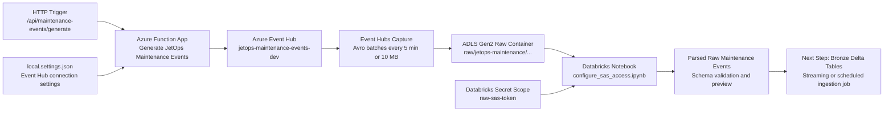
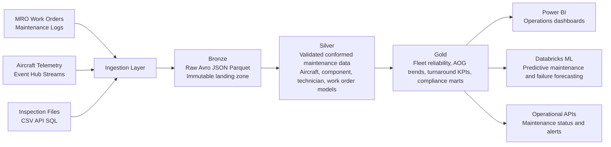
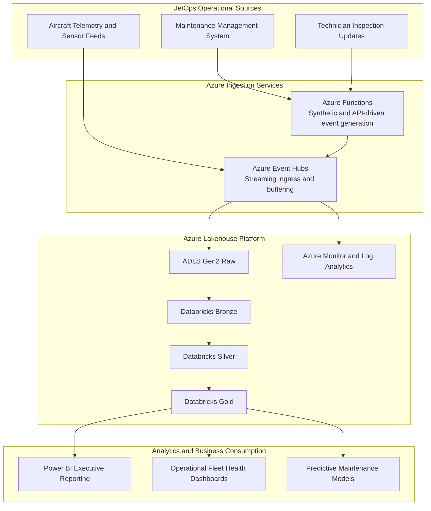

# Net-New Enterprise Lakehouse Build

## 1️⃣ What We Are Building
We are building a net-new Azure Lakehouse platform from scratch. This is not a migration, lift-and-shift, or upgrade. It is a cloud-native data platform designed to:
- Ingest enterprise data (batch + streaming)
- Store it in a structured Medallion architecture
- Enable real-time analytics
- Support machine learning
- Provide governed self-service BI
- Be deployed entirely via Infrastructure as Code

## 🏗 Core Architecture
```
Sources
   ↓
Ingestion (Batch + Streaming + API)
   ↓
Bronze (Raw)
   ↓
Silver (Cleaned + Conformed)
   ↓
Gold (Business Curated)
   ↓
BI / ML / Dashboards / APIs
```
**Key components:**
- ADLS Gen2 (Lakehouse storage)
- Delta Lake (ACID + schema enforcement)
- Databricks (transformations + ML)
- Event Hub (live streaming)
- Azure Functions (event generator)
- Governance + Catalog
- CI/CD + Terraform

No VMs. Cloud-native. Scalable.

## 📊 JetOps Reference Diagrams

### Current Ingestion Slice


### Future Bronze To Silver To Gold Flow


### Executive Architecture View
Note: Mermaid in README does not reliably support official Azure service icons across all renderers, so this diagram uses labeled Azure service blocks.



## 2️⃣ Why We Are Building It
### 🎯 Business Drivers
JetOps needs a cloud-native data platform that can unify maintenance operations, aircraft telemetry, technician updates, and inspection records in one governed environment. The platform is designed to support:
- Fleet reliability analytics
- Aircraft on ground reduction
- Faster maintenance turnaround decisions
- Predictive maintenance readiness
- Parts demand forecasting
- Compliance and audit visibility
- Real-time operational insight
- Machine intelligence enablement

The old model (Data Lake only) was storage-centric. The new model (Lakehouse) is intelligence-centric.

### 🧠 Strategic Goals
We are building this to:
1. Reduce aircraft downtime
2. Improve maintenance schedule adherence
3. Enable real-time fleet health visibility
4. Reduce manual operational reporting
5. Improve parts and labor forecasting
6. Support maintenance compliance and audit readiness
7. Enable AI-ready maintenance operations
8. Standardize enterprise governance

### 🚀 Technical Motivation
Lakehouse allows:
- BI and ML on the same data
- Streaming + batch unified
- ACID transactions
- Reduced data duplication
- Lower operational complexity
- Better cost optimization
- Modern Microsoft alignment

## 3️⃣ The AI Component
This is not just storage. We are enabling:
- Predictive maintenance and component failure forecasting
- AOG risk scoring
- Work order prioritization
- Parts demand forecasting
- Inspection anomaly detection
- Executive fleet operations Q&A

The Lakehouse becomes the foundation for intelligent business decisions.

## 4️⃣ Process for Creating It
### Phase 1 — Foundation (Platform Layer)
1. Select subscription
2. Establish landing zone
3. Configure RBAC + security baseline
4. Deploy core storage (ADLS)
5. Deploy processing engine (Databricks)
6. Deploy streaming layer (Event Hub)
7. Set up CI/CD + Terraform state
8. Establish monitoring + logging

**Outcome:** Secure, empty Lakehouse skeleton.

### Phase 2 — Data Input Phase
1. Identify and document all data sources (batch, streaming, APIs).
2. Set up secure connections to source systems.
3. Define data contracts and formats.
4. Schedule or trigger data extractions as needed.

**Outcome:** Data sources are connected and ready for ingestion.


### Phase 3 — Ingestion
1. Build batch ingestion pipelines
2. Build streaming ingestion pipelines
3. (Optional) Generate synthetic live data (Azure Function)
4. Write raw data to Bronze layer

**Outcome:** Live data flowing into the Lakehouse.

### Phase 3 — Transformation
1. Clean and validate in Silver
2. Apply data quality rules
3. Conform aircraft/component/technician/work order models
4. Create Gold operational marts
5. Optimize Delta partitions

**Outcome:** Analytics-ready data.

### Phase 4 — Governance
1. Enable catalog + lineage
2. Apply sensitivity labels
3. Define retention policies
4. Set role-based access
5. Monitor access patterns

**Outcome:** Enterprise compliance readiness.

### Phase 5 — Analytics & AI
1. Engineer features
2. Train ML models for maintenance and reliability
3. Register model
4. Batch score or stream inference
5. Write results to Gold tables
6. Build dashboards

**Outcome:** Business intelligence + predictive capability.

## 5️⃣ What Makes This Enterprise-Grade
- Persona-based design
- Real-time processing requirement
- Machine intelligence enablement
- Governance and compliance alignment
- Dev/Test/Prod cost planning approach
- Pod-based delivery structure

We are not just building pipelines. We are building a data platform capability.

## 6️⃣ Executive Summary
We are building a net-new Azure Lakehouse platform to unify JetOps maintenance data, aircraft telemetry, and inspection workflows into a governed, scalable architecture that supports real-time analytics and machine learning. The platform uses a Medallion Delta design, supports streaming and batch ingestion, enables AI use cases like predictive maintenance and AOG risk scoring, and is deployed entirely through Infrastructure as Code to ensure repeatability and enterprise compliance.

## 7️⃣ “What Is the Outcome?”
- Faster decisions
- Better fleet readiness
- Improved forecasting
- Reduced operational risk
- AI-ready enterprise data foundation

---

# JetOps (Enterprise Scenario)
This repo is framed as a JetOps maintenance and fleet operations platform.

**Company:** JetOps

**Audience:**
- Maintenance Control Leadership
- Fleet Operations
- Reliability Engineering
- IT Platform Engineering
- Data and Analytics Organization

---

## 🎯 What Use Cases Does This Solve?
### 🟢 Maintenance And Fleet Operations Use Cases
1. Aircraft maintenance log visibility in real time
2. AOG trend tracking by tail number, component, and hangar
3. Work order aging and turnaround analytics
4. Technician productivity and labor utilization analysis
5. Parts demand forecasting for critical components
6. Inspection compliance and audit traceability
7. Fleet reliability and repeat-failure detection

These directly support:
- Predictive maintenance models
- AOG risk scoring
- Maintenance performance analytics

### 🔵 Telemetry And Reliability Use Cases
1. Sensor anomaly detection from aircraft telemetry
2. Component fault trend analysis
3. Dispatch readiness monitoring
4. Maintenance event correlation with telemetry spikes
5. Failure forecasting for high-value systems

These support:
- Reliability engineering
- Operational planning
- Predictive maintenance and alerting

### 🧠 What This Lakehouse Actually Solves
| Business Challenge           | How the Lakehouse Solves It         |
|-----------------------------|-------------------------------------|
| Data silos                  | Unified Medallion storage           |
| Slow reporting              | Real-time ingestion + Gold tables   |
| Aircraft downtime           | Maintenance event visibility + predictive models |
| Parts shortages             | Time-series demand forecasting      |
| Compliance risk             | Governance + lineage                |
| Reactive maintenance        | Reliability analytics + anomaly detection |

### 🏗 What It Is NOT
It is not:
- Just a storage system
- Just a BI project
- Just a streaming project
- Just a machine learning model

It is:
An enterprise data platform capability.

---

## ▶️ Local Validation Runbook

### Run The JetOps Function App
1. Install Python 3.12 and Azure Functions Core Tools on Windows.
2. Open a new terminal after install so `py` and `func` are on PATH.
3. Change to the Azure Functions project folder.
4. Copy `local.settings.sample.json` to `local.settings.json` and set `EVENTHUB_CONNECTION_STRING` and `EVENTHUB_NAME`.
5. Install Python dependencies.
6. Start the Functions host.

```powershell
cd c:\LocalRepo\jetops-lakehouse-1\azure_function_eventhub
Copy-Item local.settings.sample.json local.settings.json
py -m pip install -r requirements.txt
func start
```

### Send Fake JetOps Maintenance Events
The HTTP route sends 25 records by default. You can override the volume with `count` and make the data repeatable with `seed`.

```powershell
Invoke-RestMethod "http://localhost:7071/api/maintenance-events/generate"
Invoke-RestMethod "http://localhost:7071/api/maintenance-events/generate?count=100"
Invoke-RestMethod "http://localhost:7071/api/maintenance-events/generate?count=100&seed=42"
```

### Validate In Databricks
1. Open `app/configure_sas_access.ipynb` in Databricks or VS Code notebook mode.
2. Ensure the Databricks secret scope contains the `raw-sas-token` secret.
3. Run the storage configuration cell.
4. Run the Avro read and schema parse cell.
5. Confirm JetOps maintenance events appear with fields such as `tail_number`, `component`, `fault_code`, and `maintenance_log_id`.

## ▶️ Foundry Playground Example

The screenshot below shows the current Azure AI Foundry playground setup using `Agent400` for a quick chat validation run inside the `fleet-maintenance-copilot` project.


