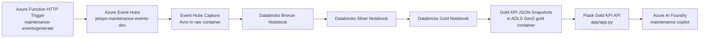

# JetOps Lakehouse

JetOps Lakehouse is an Azure-first maintenance operations reference project. It combines Terraform-managed infrastructure, a Databricks medallion pipeline, a synthetic Event Hubs producer, a Gold KPI API, and Azure AI Foundry integration notes for a fleet-maintenance copilot.

This repo is centered on JetOps maintenance events and the path from event generation to Gold KPI serving.

## What Is In This Repo

- Terraform for Azure storage, networking, Databricks, Event Hubs, and related lakehouse components.
- An Azure Functions app that generates synthetic maintenance events into Event Hubs.
- Databricks notebooks for Bronze, Silver, and Gold maintenance processing.
- A Flask API that serves Gold KPI snapshots from ADLS Gen2.
- Azure AI Foundry setup notes and version-management scripts for a maintenance copilot.

## Architecture



## Main Components

### Infrastructure

- Root Terraform files provision the baseline Azure environment.
- The [lakehouse/herbalife_eventhub.tf](lakehouse/herbalife_eventhub.tf) module adds the Event Hub namespace and hub wiring used by the JetOps event flow.
- Environment-specific names are carried through the tracked Terraform variables and `tfvars` values.

### Event Generator

The Azure Functions app in [azure_function_eventhub/function_app.py](azure_function_eventhub/function_app.py) exposes an HTTP-triggered endpoint that sends synthetic maintenance events to Event Hubs.

Key behavior:

- Route: `GET` or `POST` `/api/maintenance-events/generate`
- Default volume: `25` events
- Optional repeatability: `seed`
- Max volume: `500` events per request

The event payload generator lives in [azure_function_eventhub/maintenance_events.py](azure_function_eventhub/maintenance_events.py).

### Databricks Medallion Notebooks

The notebooks under [app/bronze_maintenance_events.ipynb](app/bronze_maintenance_events.ipynb), [app/silver_maintenance_events.ipynb](app/silver_maintenance_events.ipynb), [app/gold_maintenance_kpis.ipynb](app/gold_maintenance_kpis.ipynb), and [app/gold_kpi_inspection.ipynb](app/gold_kpi_inspection.ipynb) implement the maintenance-event pipeline.

Current flow:

1. Bronze reads raw Event Hubs capture and normalizes maintenance events.
2. Silver cleans and deduplicates events.
3. Gold builds KPI marts for daily operations, component reliability, and fleet status.
4. Gold also writes JSON snapshot outputs for the serving API.

The Databricks job chain definition is in [databricks_cluster/maintenance_notebook_job_chain.json](databricks_cluster/maintenance_notebook_job_chain.json).
With that schedule enabled, new generated events automatically move from Event Hubs capture to Bronze, Silver, Gold, and finally into the Gold API snapshot folders that [app/gold_kpi_service.py](app/gold_kpi_service.py) serves.

### Gold KPI API

The API in [app/app.py](app/app.py) serves curated KPI data backed by [app/gold_kpi_service.py](app/gold_kpi_service.py).

Primary endpoints:

- `GET /api/gold/health`
- `GET /api/gold/metadata`
- `GET /api/gold/openapi.json`
- `GET /api/gold/kpis/executive`
- `GET /api/gold/kpis/daily-operations?days=14`
- `GET /api/gold/kpis/component-reliability?days=7&limit=20`
- `GET /api/gold/kpis/fleet-watchlist?limit=50`

Important behavior:

- All `/api/gold/*` routes require the `x-api-key` header.
- The API reads JSON snapshots from the Gold container in ADLS Gen2.
- The root `/` route still supports a legacy SQL-backed dashboard when `JETOPS_SQL_CONNECTION_STRING` is configured.

The OpenAPI contract checked into the repo is [app/gold_kpi_api_openapi.json](app/gold_kpi_api_openapi.json).

### Azure AI Foundry

The Foundry integration notes are in [azure_foundry_incorporation.md](azure_foundry_incorporation.md) and [foundry/fleet_maintenance_copilot_setup.md](foundry/fleet_maintenance_copilot_setup.md).

The version-management script is [scripts/manage_foundry_agent_versions.py](scripts/manage_foundry_agent_versions.py). It is intended to:

- fetch the protected OpenAPI document
- attach it to the Foundry agent through the `jetops-gold-api-key` project connection
- create a new agent version
- compare the latest versions on a fixed question set

The script expects additional Python packages beyond the Flask API requirements, including `azure-ai-projects`, `azure-identity`, `jsonref`, and `requests`.

The stored comparison artifact is [foundry/agent_version_comparison.json](foundry/agent_version_comparison.json).

#### Foundry Playground Example

The screenshot below is an example Azure AI Foundry playground view inside the `fleet-maintenance-copilot` project.

For live KPI validation, use the repo-managed agent `fleet-maintenance-copilot-agent`. Older ad hoc playground agents such as `Agent400` are not authoritative and can be missing the protected Gold API tool wiring.


## Repo Layout

```text
.
|-- app/
|   |-- app.py
|   |-- gold_kpi_service.py
|   |-- bronze_maintenance_events.ipynb
|   |-- silver_maintenance_events.ipynb
|   |-- gold_maintenance_kpis.ipynb
|   |-- gold_kpi_inspection.ipynb
|   `-- configure_sas_access.ipynb
|-- azure_function_eventhub/
|   |-- __init__.py
|   |-- function_app.py
|   |-- maintenance_events.py
|   |-- local.settings.sample.json
|   |-- requirements.txt
|   `-- smoke_test.py
|-- databricks_cluster/
|   `-- maintenance_notebook_job_chain.json
|-- foundry/
|   |-- fleet_maintenance_copilot_setup.md
|   `-- agent_version_comparison.json
|-- scripts/
|   |-- bulk_trigger_load.py
|   |-- manage_foundry_agent_versions.py
|   |-- smoke_test_adls_foundry.py
|   `-- stop_bulk_trigger_load.py
|-- lakehouse/
|   |-- herbalife_eventhub.tf
|   |-- outputs.tf
|   `-- variables.tf
```

## Prerequisites

- Python `3.11+` for the Flask API and Azure Function local runs.
- Azure Functions Core Tools for local Function testing.
- Azure CLI for storage-key lookup and other Azure operations.
- Access to the target Azure subscription, Databricks workspace, storage account, and Event Hub.
- Databricks workspace access if you want to run the notebooks in-cluster.

## Local Workflows

### 1. Run The Azure Function Locally

```powershell
cd c:\LocalRepo\jetops-lakehouse-1\azure_function_eventhub
Copy-Item local.settings.sample.json local.settings.json
py -m pip install -r requirements.txt
func start
```

Then send synthetic events:

```powershell
Invoke-RestMethod "http://localhost:7071/api/maintenance-events/generate"
Invoke-RestMethod "http://localhost:7071/api/maintenance-events/generate?count=100"
Invoke-RestMethod "http://localhost:7071/api/maintenance-events/generate?count=100&seed=42"
```

For larger backfills or repeatable load generation, use the bulk trigger script from the repo root:

```powershell
py scripts/bulk_trigger_load.py --iterations 10 --count-per-request 500 --delay-seconds 2
```

To keep sending data until you explicitly stop it:

```powershell
py scripts/bulk_trigger_load.py --continuous --count-per-request 500 --delay-seconds 5
```

To stop a running load loop from another terminal:

```powershell
py scripts/stop_bulk_trigger_load.py
```

Add `--force` to the stop command if you need the tracked loader process terminated immediately.

For a quick local smoke test without Event Hubs, use [azure_function_eventhub/smoke_test.py](azure_function_eventhub/smoke_test.py).

### 2. Run The Gold KPI API Locally

```powershell
cd c:\LocalRepo\jetops-lakehouse-1\app
py -m pip install -r requirements.txt
$env:JETOPS_API_KEY = "replace-me"
$env:JETOPS_STORAGE_ACCOUNT_KEY = "replace-me"
py app.py
```

Example requests:

```powershell
Invoke-RestMethod -Headers @{ "x-api-key" = $env:JETOPS_API_KEY } "http://localhost:8000/api/gold/health"
Invoke-RestMethod -Headers @{ "x-api-key" = $env:JETOPS_API_KEY } "http://localhost:8000/api/gold/kpis/executive"
```

### 3. Validate In Databricks

Use the notebooks in [app](app) for the medallion flow.

Important auth detail:

- The notebooks still support SAS-token secrets.
- The current default is `JETOPS_STORAGE_AUTH_MODE=account_key`.
- That path expects the Databricks secret `storage-account-key` unless you override the secret names.

If you use [app/configure_sas_access.ipynb](app/configure_sas_access.ipynb), that notebook is specifically for SAS-token setup. The Bronze, Silver, and Gold notebooks default to account-key mode.

### 4. Build The Gold API Container

The API container build path in this repo is:

```powershell
az acr build --resource-group rg-aviator-core-prod --registry aviatoracrjetops01 --image jetops-gold-api:latest --file app/Dockerfile app
```

The container definition is in [app/Dockerfile](app/Dockerfile).

## Key Configuration

### Azure Function Local Settings

The sample file is [azure_function_eventhub/local.settings.sample.json](azure_function_eventhub/local.settings.sample.json).

Required values:

- `AzureWebJobsStorage`
- `FUNCTIONS_WORKER_RUNTIME`
- `EVENTHUB_CONNECTION_STRING`
- `EVENTHUB_NAME`

### Gold API Environment Variables

Common variables used by [app/app.py](app/app.py) and [app/gold_kpi_service.py](app/gold_kpi_service.py):

- `JETOPS_API_KEY`
- `JETOPS_STORAGE_ACCOUNT_KEY`
- `JETOPS_STORAGE_ACCOUNT`
- `JETOPS_RESOURCE_GROUP`
- `JETOPS_GOLD_CONTAINER`
- `JETOPS_GOLD_API_SNAPSHOT_ROOT`
- `PUBLIC_BASE_URL`
- `JETOPS_SQL_CONNECTION_STRING` for the optional legacy dashboard route

## What The Project Currently Demonstrates

- Event generation into Azure Event Hubs
- Databricks Bronze, Silver, and Gold transformations
- Gold KPI serving through a protected Flask API
- OpenAPI-based tool wiring for Azure AI Foundry
- A practical maintenance-copilot test path in Foundry

## Current Gaps

- The README does not attempt to document every Terraform resource in detail.
- Ad hoc playground agents (e.g. `Agent400`) can drift from the repo-managed `fleet-maintenance-copilot-agent`. If the named agent is missing, recreate it by running the inline creation block documented in [foundry/fleet_maintenance_copilot_setup.md](foundry/fleet_maintenance_copilot_setup.md). The `manage_foundry_agent_versions.py` script targets the `azure-ai-projects` 2.x SDK API and will not run against the 1.x SDK installed by `azure-cli`.
- No embedding or vector search layer is wired in. The Foundry agent is tool-grounded against the Gold KPI API only. RAG over maintenance history (Azure AI Search + `text-embedding-3-small`) is a planned next phase.
- Terraform variable defaults in `variable.tf` contain placeholder passwords; these should be removed and sourced from Azure Key Vault in a production deployment.

